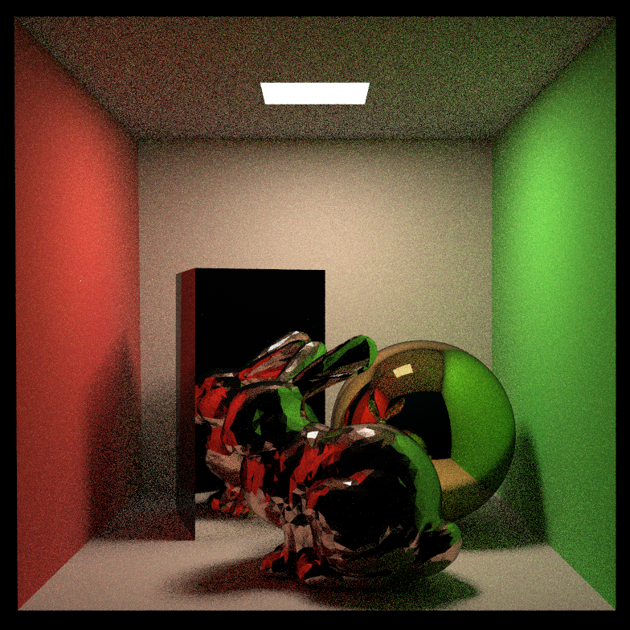
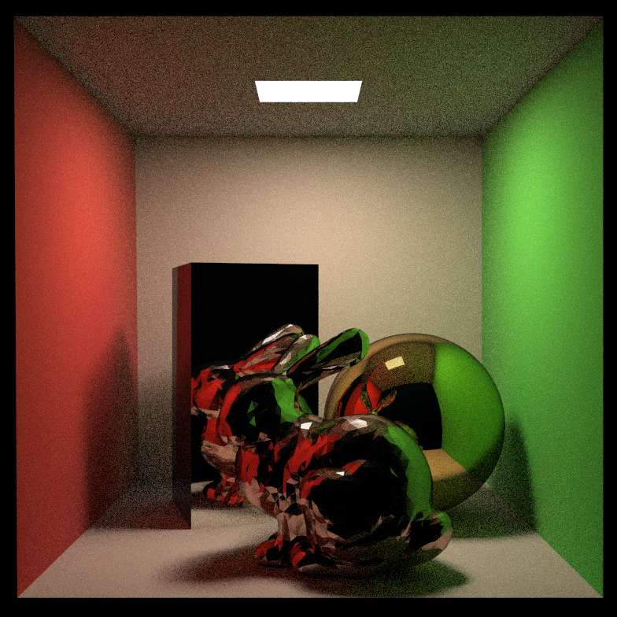
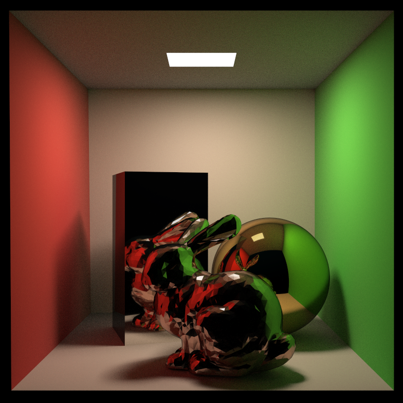
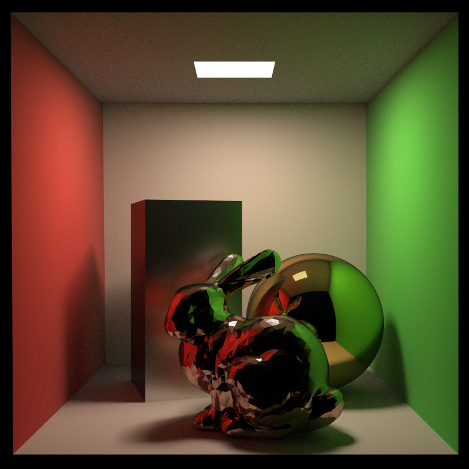

# MiniRayTracerPBR
$$
L_o(p, \omega_o) = L_e(p, w_o) + \int_{\Omega}f(p, \omega_i\rightarrow\omega_o)L_i(p, \omega_i)\cos\theta\mathrm{d}\omega_i
$$
  Multithread RayTracer(Cook-Torrance model, metallic workflow) implemented by C++.

  The basic code frame comes from [GAMES101.2020](https://sites.cs.ucsb.edu/~lingqi/teaching/games101.html) Assignment7.

## Features
+ Cook-Torrance BRDF model
+ metallic workflow(material can be adjusted by [albedo, roughness, metallic], I've defined three materials(copper, silver, gold) in main.cpp as example)
+ importance sampling microfacet-based BSDF based on GGX NDF(normal distribution function)
+ speed up intersection detection of triangle mesh with BVH
+ implement anti-aliasing by create random ray inside one pixel.(not by filter)
## Results
| ssp16 | ssp32 |
| :------: | :------: |
||

|ssp128| ssp512 |
| :------: | :------: |
|||

|ssp512 rough| ssp512 all rough|
| :------: | :------: |
||

## Bugs
+ **SOLVED** ~~Rarely there will be particularly bright noise pointer, I think it's caused by dividing very small float(some pdf could be), maybe just spp is not high enough or algorithm's limitation?~~

## Future work
+ random number generation is very expensive
+ the implementation of Multi-threading needs to be improved(divide into blocks)
+ the code is untidy and needs cleaning
+ support common types of textures(normal map, albedo/roughness/metallic map..)
+ support transparent/anisotropic materials

## Reference
+ https://learnopengl.com/PBR/Theory
+ http://jcgt.org/published/0007/04/01/paper.pdf
+ https://agraphicsguy.wordpress.com/2015/11/01/sampling-microfacet-brdf/
+ https://schuttejoe.github.io/post/ggximportancesamplingpart1/
+ https://computergraphics.stackexchange.com/questions/7656/importance-sampling-microfacet-ggx
+ https://sites.cs.ucsb.edu/~lingqi/teaching/resources/GAMES101_Lecture_16.pdf
+ https://sites.cs.ucsb.edu/~lingqi/teaching/resources/GAMES101_Lecture_17.pdf
+ https://github.com/Bly7/OBJ-Loader

## Tips
+ please run the program in release mode, make sure you are not in debug mode when testing your high spp result(otherwise it will be a disaster).
+ It takes about 270 seconds to complete the rendering(mingw-w64/gcc) when spp=512 with cpu i7-9750H(2.60GHz,6c12t)
+ Sorry, my english is poor.

